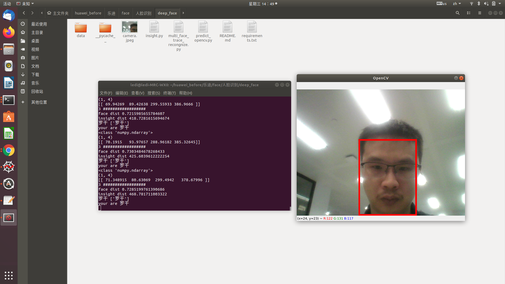

## Quick start

1. Either install using pip  wait about some minintr:
    ```bash
    pip install  -r requirements.txt
    ```


2. In python, import the module:
    ```
    
    cd ./deep_face/data/test_images
    
    mkdir your_name
    ```
3. add your face picture into /deep_face/data/test_images


4.  run the code :
    ```
    python multi_face_trace_recongnize.py
    ```
    
    
 A full face tracking example by opencv can be found at 


